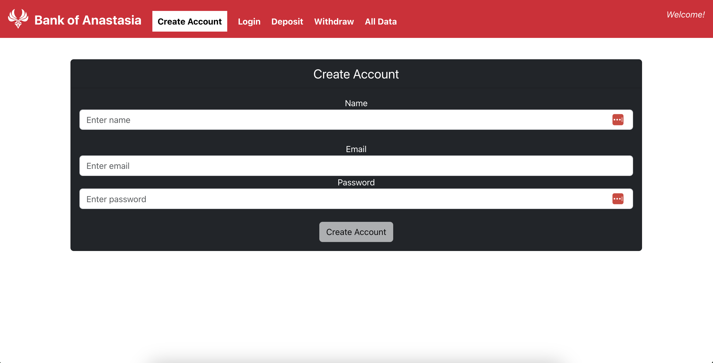
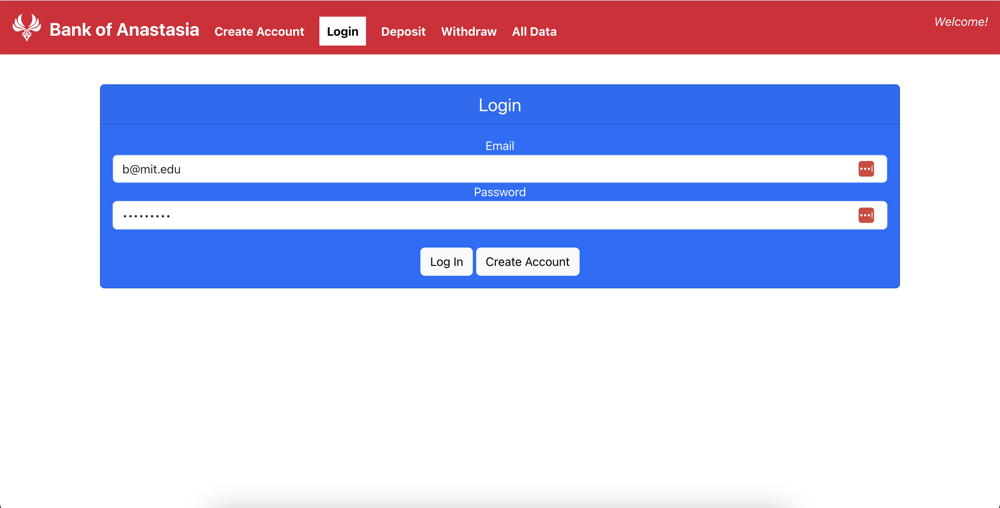
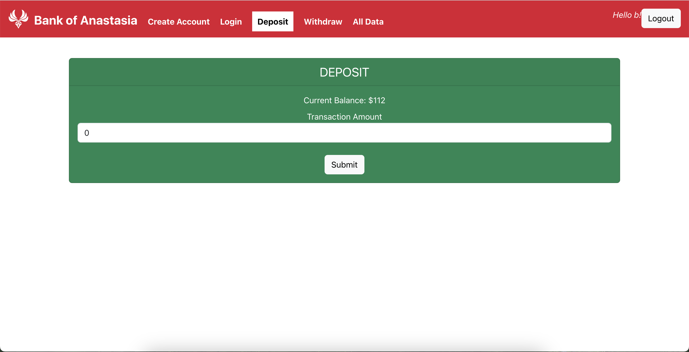
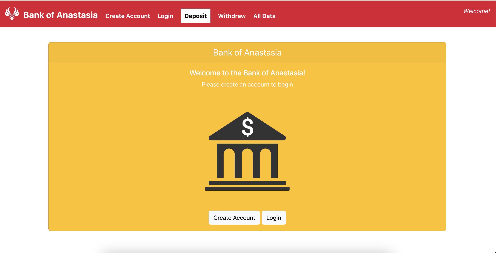
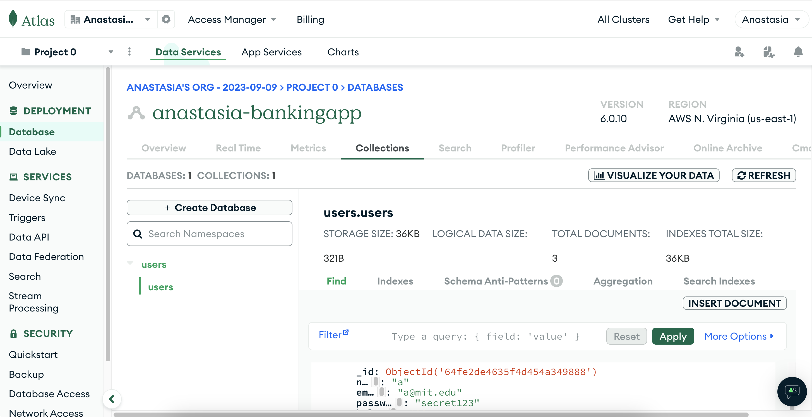

# Bank of Anastasia

Bank of Anastasia is MERN (MongoDB, Express.js, React.js, Node.js) stack application that simulates the experience of using a bank. Users can create an account, login/logout, and deposit/withdraw money into their accounts. This project was created as the final capstone project for the MIT xPro Coding Bootcamp for Women (November 2022 cohort). Through building this app, I have learned how to bring together skills for web, frontend, and backend development.

This project was bootstrapped with [Create React App](https://github.com/facebook/create-react-app).

For any overview of this project, its background, and a live demo, please see these videos and slide deck that I've created as part of the final presentation for this capstone project.
[Anastasia_Lamothe_PresentationVideo1](https://www.loom.com/share/2bed0f85a5394b8aa06c63715e11fbdd?sid=e8e66545-5e8f-47cb-b8d6-c8013a4ed622)
[Anastasia_Lamothe_PresentationVideo2](https://www.loom.com/share/6e2c5df4a4204fb489ed06bfe6442b73?sid=bb6156c1-7a8f-4842-ab5d-653e4a3cd664)
[Anastasia_Lamothe_PresentationVideo3](https://www.loom.com/share/403cfc0d4e0f41f6bf4865e1fc460981?sid=da461b87-558f-4010-af68-bac0af2e4cf5)
[Anastasia_Lamothe_Presentation](https://docs.google.com/presentation/d/1x55PXasFzKKdXC1NVu4rMLlDsZ52HjLUikV1XM0EOPM/edit?usp=sharing)

## Product Documentation

### Deployed Website

The full site is deployed on [Heroku](https://anastasia-lamothefullbankapp-e1b31bc0a03a.herokuapp.com/#/), using a Docker image. You can also run the site by following the Installation Guidelines below.

### Installation Guidelines

1. Clone the repository to your local machine using the command: `git clone https://github.com/aelamothe/banking-app.git`
2. Navigate to the project directory: `cd banking-app`
3. Install the necessary dependencies using the command: `npm install`
4. To start the project, use the command: `npm start`
5. The application will be running at [http://localhost:3000](http://localhost:3000)

### Technology Used

- React.js: A JavaScript library for building user interfaces.
- Node.js: A JavaScript runtime built on Chrome's V8 JavaScript engine.
- Express: A minimal and flexible Node.js web application framework.
- MongoDB: A source-available cross-platform document-oriented database program.
- Yup.js: A JavaScript schema builder for value parsing and validation.

### Features

- User Registration: Allows new users to create an account with name, email, and password.
  
- User Login: Enables users to log in using their registered email and password.
  
- Account Management: Allows users to manage their balance through deposit and withdraw transactions.
  
- User Logout: Enables users to logout of their account and return to home page. Logout button only appears if a user is logged in.
  
- User Database: Database of user information stored in MongoDB Atlas.
  
- Future Features:
  - Enhanced Security: Implement additional security features (authentication/authorization) to protect user data.
  - Responsive Design: Improve the design to be fully responsive on all devices.
  - Improved Functionality: Improve functionality of linking in navbar so that highlighted links in NavBar update appropriately.
  - Accounts Page: Implement account settings for users to update personal information.

### License

This project is licensed under the MIT License.

## API Documentation

In this project, we have several API endpoints defined in our backend `server.js` file that enable various functionalities in the application. Below is a brief description of each endpoint:

### `POST /api/users`

- **Description**: Creates a new user in the database.
- **Request Body**:
  - `name` (string): The name of the new user.
  - `email` (string): The email address of the new user.
  - `password` (string): The password for the new user.
- **Responses**:
  - `200 OK`: The user was successfully created.
  - `400 Bad Request`: The user with the given email already exists or other input validation issues.
  - `500 Internal Server Error`: A server error occurred.

### `GET /api/users`

- **Description**: Retrieves a list of all users from the database.
- **Responses**:
  - `200 OK`: Successfully retrieved the list of users.
  - `500 Internal Server Error`: A server error occurred.

### `GET /api/users/:email`

- **Description**: Retrieves the data of a user with the specified email from the database.
- **Path Parameters**:
  - `email` (string): The email of the user to retrieve.
- **Responses**:
  - `200 OK`: Successfully retrieved the user data.
  - `404 Not Found`: No user found with the given email.
  - `500 Internal Server Error`: A server error occurred.

### `POST /api/login`

- **Description**: Verifies user login credentials.
- **Request Body**:
  - `email` (string): The email address of the user trying to log in.
  - `password` (string): The password of the user trying to log in.
- **Responses**:
  - `200 OK`: Login successful.
  - `400 Bad Request`: Incorrect credentials.
  - `500 Internal Server Error`: A server error occurred.

### `POST /api/users/updateBalance`

- **Description**: Updates the balance of a user.
- **Request Body**:
  - `email` (string): The email address of the user whose balance is to be updated.
  - `newBalance` (number): The new balance to update to.
- **Responses**:
  - `200 OK`: Balance successfully updated.
  - `400 Bad Request`: Missing or invalid request parameters.
  - `404 Not Found`: No user found with the given email.
  - `500 Internal Server Error`: A server error occurred.

## Learn More

You can learn more in the [Create React App documentation](https://facebook.github.io/create-react-app/docs/getting-started).

To learn React, check out the [React documentation](https://reactjs.org/).
